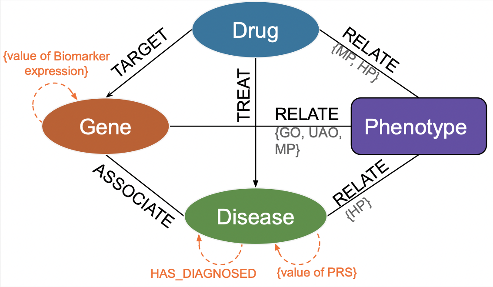

<p align="center">
  
</p>


## Input File Formats

Format of `{patients_data_filepath}.csv`:
```
A column named EID must contain the {patient_id}. 
Each column representing a protein biomarker of interest should have the biomarker's name as its column name, with the corresponding expression values as its content. 
PRS values for diseases should be designated as column names in the format: PRS_{C_index_of_disease}.
```

Format of `{kg_filepath}.txt`:
*check the KG schema or the paper for different relation types*
```
DB00363	TREAT	C0012236
DB01008	TREAT	C0740302
DB01190	TREAT	C0243001
```
 

Format of `ad_pre.txt`:
```
C0002395	TREAT_reverse	DB03041
C0002395	TREAT_reverse	DB01412
C0002395	TREAT_reverse	DB00291
```

## 🔴 Preprocessing

1. Run the patient merging script:

    Inputs:
    - Read in a patient by reading `{patients_data_filepath}.csv`
    - Read in the general KG by reading `{kg_filepath}.txt`
    - Read in the Patient ID of interest `{patient_id}`
    ```bash
    % python patient_merge.py -kg_fp {kg_filepath}.txt -patients_data_fp {patients_data_filepath}.csv -pid {patient_id}
    ```
    Outputs:
    - Scalars will be saved to `outputs/scalars_{patient_id}.npy`
    - Patient-merged KG will be saved to `outputs/patient_merged_kg_{patient_id}.txt`
    
2. Relocate `outputs/patient_merged_kg_{patient_id}.txt` to `data/` and relocate `outputs/scalars_{patient_id}.npy` to `code/data/`.

## 🔴 Embedding

Preconditions:
- All knowledge graphs must be in `data/`
- `scalars_{patient_id}.npy` should be in `code/data/`

### Embedding the Baseline KG

1. Stratified Split:
    ```bash
    % python split_GPKG.py -kg_filepath 'data/knowledge_graph.txt'
    ```
2. Run the main model:
    ```bash
    % python main.py -data test_data -gpu 1 -name test_model -epoch 500
    ```

### Embedding the Patient-Infused KG

1. Stratified Split for patient-infused KG:
    ```bash
    % python split_GPKG.py -kg_filepath 'data/patient_merged_kg_{patient_id}.txt'
    ```
2. Run the patient-infused model for patient {patient_id}:
    ```bash
    % python main.py -data test_data -gpu 1 -name test_model_{patient_id} -epoch 500 -scalars ./data/scalars_{patient_id}.npy
    ```

## 🔴 Predicting

Preconditions:
- A test file named `ad_pre.txt`must be created and moved the file to the folder `test_data`.

### Baseline Model

- Run the test script:
  ```bash
  % python test.py -data test_data -gpu 1 -name test_model -save_result pre_results.txt -test_file ad_pre.txt -logdir ./log_test/
  ```

### Patient Model

- Run the test script:
  ```bash
  % python test.py -data test_data -gpu 1 -name test_model_{patient_id} -save_result pre_results_{patient_id}.txt -test_file ad_pre.txt -scalars ./data/scalars_{patient_id}.npy -logdir ./log_test/
  ```

### Predictions will be in the file specified in `-save_result` for each drug.
